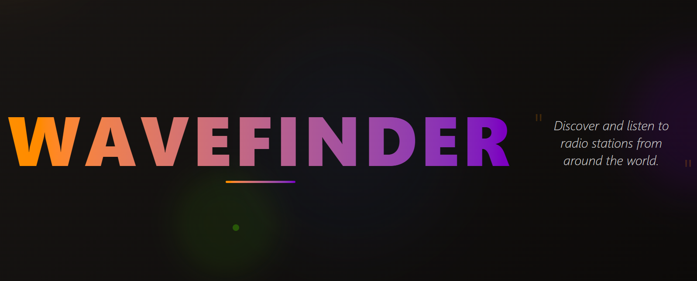
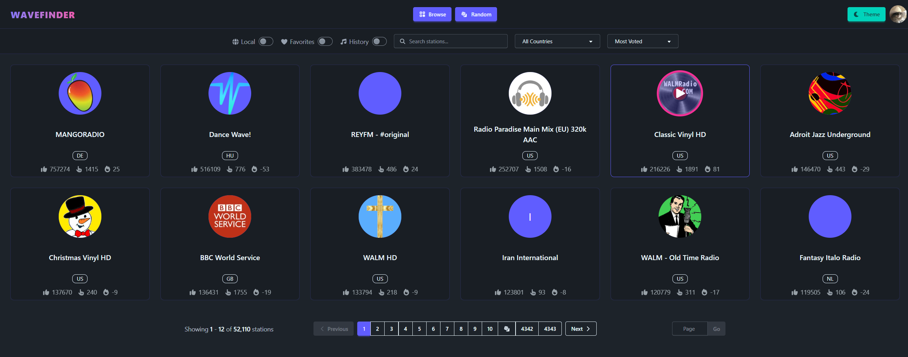
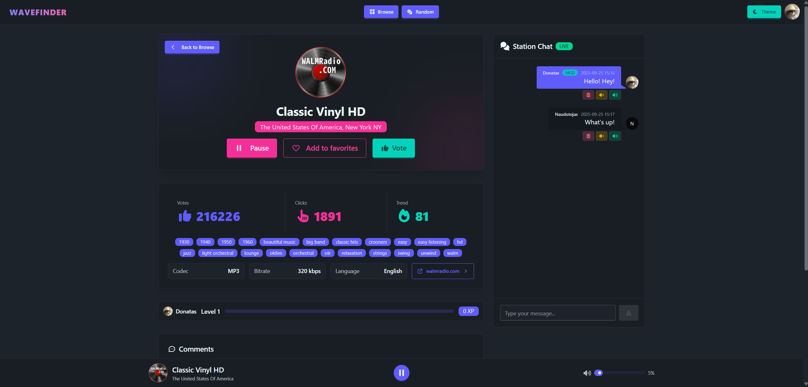

# Wavefinder

A radio station player webapp built with Laravel + Inertia/React. Wavefinder keeps a local mirror of [Radio Browser](https://www.radio-browser.info) stations, adds user stats and levels, and gives listeners a place to chat.

## Features
- Browse 50,000+ stations with filters, search, and random picks via the [Radio Browser API](https://www.radio-browser.info).
- Sign in to track listening time, gain levels, and favourite stations.
- Live chat with moderation (mute, delete) and profanity filtering.
- Sticky player bar powered by Howler.js and a themeable UI (Tailwind + daisyUI).

## Screenshots



## Backend
- Radio sync: `php artisan radio:download` rotates Radio Browser DNS mirrors (`all.api.radio-browser.info`), stores active stations, and drops offline ones via the [Radio Browser API](https://www.radio-browser.info).
- Votes: one vote per user / 10min and reported back to Radio Browser for analytics using the [Radio Browser API](https://www.radio-browser.info).
- Listening sessions: start/stop plus 30s heartbeats convert playtime -> XP and profile stats.
- XP and levels: computed on the `User` model with progress bars and XP to next level.
- Chat and moderation tools: rate limiting, profanity filter, moderator mute/unmute, message deletion.
- Pruning: Laravel `MassPrunable` keeps only recent chat by a configurable window.
- Auth: register, login, logout, password reset email, and change password in settings.
- GeoIP: country saved on first login for future regional reporting.

## Frontend
- Inertia + React pages for a fast SPA feel with Laravel controllers under the hood.
- Browse: country dropdown, favourites/history filters, search, quick play/favourite actions.
- Local toggle: show stations from your country via GeoIP.
- Station page: player controls (Howler.js), Font Awesome icons, voting, XP data.
- Live chat: real-time for guests and signed-in users with moderator tools inline.
- Profile and settings: avatars, passwords, personal stats.

## Architecture & Stack
- Backend: PHP 8.2, Laravel 12, Inertia 2.0 server adapter, Laravel Reverb for WebSockets, scheduled commands.
- Frontend: React 18, Vite, TailwindCSS + daisyUI, Font Awesome, Howler.js.
- Data: SQLite by default (stations, favourites, votes, chat, comments, listening sessions, profiles).
- Broadcasting: Laravel Echo + `pusher-js` (Reverb uses the Pusher protocol).

## Quickstart

```bash
# 1) Install
cp .env.example .env
composer install
npm install

# 2) App key + storage + DB
php artisan key:generate
php artisan storage:link
# SQLite (recommended for dev):
mkdir -p database && touch database/database.sqlite
php artisan migrate

# 3) Run dev (HTTP + Vite + Reverb via Composer script)
composer run dev

# 4) First data sync (fetch stations)
php artisan radio:download
```

## Configuration

**Chat retention**

Wavefinder prunes chat automatically. Control it with:

```dotenv
CHAT_RETENTION_HOURS=24   # how many hours to keep messages (0 disables)
CHAT_MAX_PER_STATION=200  # soft cap messages shown per station in the chat
```
